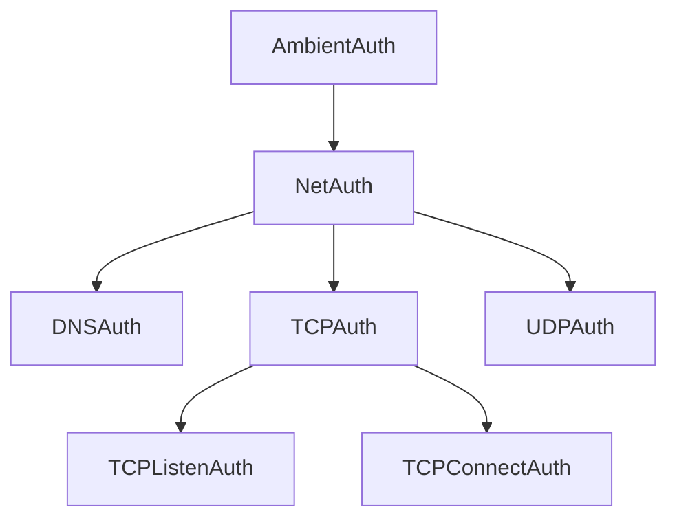

---
hide:
  - toc
---

# Authority Hierarchy

## Problem

You're building a library that controls access to system resources like network sockets, the filesystem, or external processes. Pony's object capability system lets you enforce this through authority tokens, and the broadest token is `AmbientAuth`, which the runtime hands to `Main` through `env.root`.

The simplest thing to do is require `AmbientAuth` everywhere:

```pony
actor DNSResolver
  new create(auth: AmbientAuth) =>
    // ... set up DNS resolution
    None

actor TCPServer
  new create(auth: AmbientAuth, port: String) =>
    // ... bind and listen on a TCP port
    None
```

This works, but it's far too permissive. That `DNSResolver` only needs to look up hostnames, yet it holds the same token that grants access to the filesystem, process spawning, and every other system resource. If a bug or malicious input causes the resolver to do something unexpected, nothing in the type system prevents it from opening files or binding additional sockets. You've given every component the keys to the entire kingdom when each one only needs access to its own room.

The principle of least authority says each component should receive only the permissions it actually requires. What you need is a way to narrow `AmbientAuth` into smaller, more specific tokens, and to do that in layers so you can hand out exactly the right level of access.

## Solution

The idea is straightforward: define stateless primitives that act as capability tokens, where each primitive's constructor accepts only the authorities above it in the hierarchy. Since the constructor is the only way to create the token, the type system enforces that you can't obtain a narrow capability without first holding a broader one.

Start with a single narrowing step. A `NetAuth` token represents general networking authority, and you can only create one if you have `AmbientAuth`:

```pony
primitive NetAuth
  new create(from: AmbientAuth) =>
    None
```

The constructor body is empty. The primitive doesn't store anything. Its entire purpose is to exist as a type that proves "someone with `AmbientAuth` authorized networking." Because primitives are singletons, there's no allocation cost; the runtime reuses the same value every time.

Now branch the hierarchy. Networking covers several distinct capabilities: DNS resolution, TCP, and UDP. Each of these should accept either `AmbientAuth` directly (for convenience at the top level) or `NetAuth` (for code that's already been narrowed to networking):

```pony
primitive DNSAuth
  new create(from: (AmbientAuth | NetAuth)) =>
    None

primitive TCPAuth
  new create(from: (AmbientAuth | NetAuth)) =>
    None

primitive UDPAuth
  new create(from: (AmbientAuth | NetAuth)) =>
    None
```

The union type `(AmbientAuth | NetAuth)` in the constructor is what makes this flexible. If you have `AmbientAuth`, you can create any of these directly. If you only have `NetAuth`, you can still create them. But you can't use a `NetAuth` to create a `FileAuth` because the types don't match.

Add a third level. TCP itself can be subdivided: listening for incoming connections is a different capability than making outgoing ones. These leaf tokens accept the full chain above them:

```pony
primitive TCPListenAuth
  new create(from: (AmbientAuth | NetAuth | TCPAuth)) =>
    None

primitive TCPConnectAuth
  new create(from: (AmbientAuth | NetAuth | TCPAuth)) =>
    None
```

Now your APIs can require exactly the right token. A TCP listener requires `TCPListenAuth`, a DNS resolver requires `DNSAuth`, and neither can be used for anything else:

```pony
actor DNSResolver
  new create(auth: DNSAuth) =>
    // ... set up DNS resolution
    None

actor TCPServer
  new create(auth: TCPListenAuth, port: String) =>
    // ... bind and listen on a TCP port
    None
```

The caller narrows authority step by step. `Main` starts with `AmbientAuth` and hands out only what each component needs:

```pony
actor Main
  new create(env: Env) =>
    let net = NetAuth(env.root)
    let dns = DNSAuth(net)
    let listen = TCPListenAuth(net)

    let resolver = DNSResolver(dns)
    let server = TCPServer(listen, "8080")
```

Notice that `Main` creates `NetAuth` once and derives both `DNSAuth` and `TCPListenAuth` from it. The resolver can't listen on sockets; the server can't resolve hostnames. Each component has exactly the authority it needs.

Here's the hierarchy we just built, visualized as a tree. Authority flows downward; each node can only be created by someone holding a node above it:



The standard library's `net` package defines exactly this hierarchy. The `files` package adds a separate branch with `FileAuth` derived directly from `AmbientAuth`, and you could imagine other packages adding their own top-level branches for process spawning, environment variables, and so on.

To see how this works when you design your own hierarchy, here's a complete example for an imaginary storage library. The library supports reading and writing to a data store, and you want callers to request read-only or write-only access:

```pony
primitive StorageAuth
  """
  Authority to perform any storage operation.
  """
  new create(from: AmbientAuth) =>
    None

primitive ReadAuth
  """
  Authority to read from the data store.
  """
  new create(from: (AmbientAuth | StorageAuth)) =>
    None

primitive WriteAuth
  """
  Authority to write to the data store.
  """
  new create(from: (AmbientAuth | StorageAuth)) =>
    None

actor StorageReader
  let _out: OutStream

  new create(auth: ReadAuth, out: OutStream) =>
    _out = out
    _out.print("Reader created with read-only access")

actor StorageWriter
  let _out: OutStream

  new create(auth: WriteAuth, out: OutStream) =>
    _out = out
    _out.print("Writer created with write-only access")

actor Main
  new create(env: Env) =>
    let storage = StorageAuth(env.root)
    let read = ReadAuth(storage)
    let write = WriteAuth(storage)

    StorageReader(read, env.out)
    StorageWriter(write, env.out)
```

The `StorageReader` can't write, the `StorageWriter` can't read, and neither can do anything outside the storage system. All of this is enforced at compile time.

## Discussion

These authority primitives have zero runtime cost. Primitives in Pony are singletons: they're never allocated and never garbage collected. Passing one around is just passing a pointer to a global value. The constructors do nothing (their bodies are `None`), so creating a derived token is free. All the enforcement happens in the type checker. If you don't have a value of the right type to pass to the constructor, your code won't compile.

The type system also prevents lateral movement in the hierarchy. Looking at the tree again:


If you hold a `TCPListenAuth`, you can't use it to create a `TCPConnectAuth`. The constructor for `TCPConnectAuth` accepts `(AmbientAuth | NetAuth | TCPAuth)`, and `TCPListenAuth` isn't in that union. You'd need to go back up the hierarchy to `TCPAuth` or higher and come back down the other branch. This is the whole point: authority only flows downward, never sideways.

When designing your own hierarchy, start from the broadest capability your library offers and subdivide by the kinds of side effects it can perform. Each leaf should correspond to one kind of operation. If your library does both network I/O and file I/O, those should be separate branches. Within network I/O, if listening and connecting have different security implications, they should be separate leaves. The [ponylang/lori](https://github.com/ponylang/lori) networking library extends the stdlib hierarchy further with its own `TCPServerAuth` that narrows `TCPListenAuth` by one more level.

Authority hierarchy controls *what* a component is allowed to do. The [Single Use Object Capabilities](single-use.md) pattern addresses a different dimension: *how many times* a component can exercise its authority. The two compose naturally. You might define a hierarchy of auth tokens to control which operations are available, then wrap a leaf token in an `iso` class to make it single-use. The hierarchy narrows the scope; the single-use wrapper limits the count.
